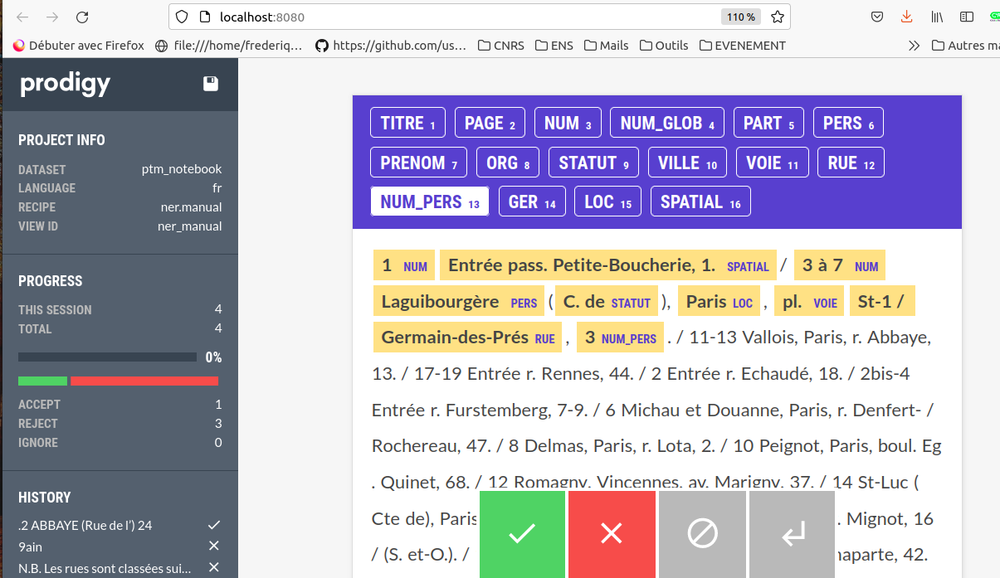

Comment importer et annoter les données dans un outil d'annotation ? Plus précisement dans notre cas, comment utiliser Prodigy ?

Comment créer un modèle d'annotation à partir des données annotées ?

Comment appliquer à un corpus non annoté son model ?

